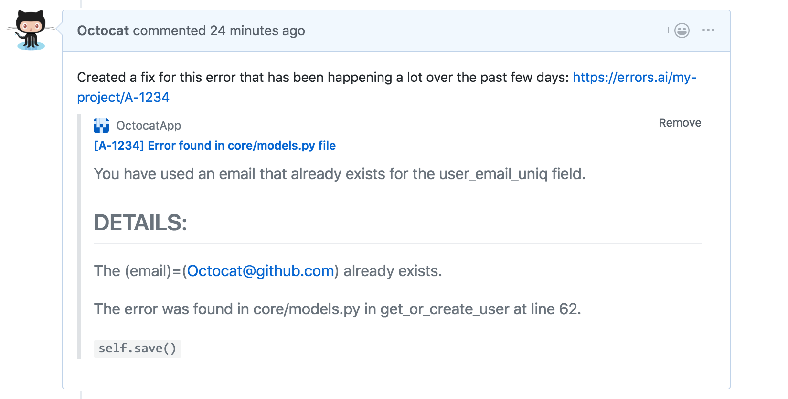

# Markdown on GitHub
Basic writing and formatting syntax
Create sophisticated formatting for your prose and code on GitHub with simple syntax.
## Headings
To create a heading, add one to six # symbols before your heading text
# The largest heading
###### The smallest heading


## Styling text  
You can indicate emphasis with bold, italic, or strikethrough text.
### Bold
__    __ or **  **

**This is bold text**
Italic

_    _ or *  *

*This text is italicized*
### Strikethrough
~~ ~~

~~This was mistaken text~~

### Quoting text
You can quote text with a >

To format code or text into its own distinct block, use triple backticks.

Some basic Git commands are:
```
git status
git add
git commit
```
## Links
You can create an inline link by wrapping link text in brackets [ ], and then wrapping the URL in parentheses ( ). You can also use the keyboard shortcut command + k to create a link.
This site was built using [GitHub Pages](https://pages.github.com/)


## Lists

You can make an unordered list by preceding one or more lines of text with - or *.
- George Washington
- John Adams
To order your list, precede each line with a number.

1. James Madison
2. James Monroe
To create a nested list using the web editor on GitHub or a text editor that uses a monospaced font, like Atom, you can align your list visually. Type space characters in front of your nested list item, until the list marker character (- or *) lies directly below the first character of the text in the item above it.

1. First list item
   - First nested list item
     - Second nested list item

## Task lists
To create a task list, preface list items with a regular space character followed by [ ]. To mark a task as complete, use [x].

- [x] Finish my changes
- [ ] Push my commits to GitHub
- [ ] Open a pull request

## Mention 
Mentioning people and teams
You can mention a person or team on GitHub by typing @ plus their username or team name

## Content attachments
Some GitHub Apps provide information in GitHub for URLs that link to their registered domains. GitHub renders the information provided by the app under the URL in the body or comment of an issue or pull request.
